# Extracted Content from a4efabe9-a5cd-41e0-8bd2-4970ccb2e485

---

# Page 1

### Figure: Figure 1

1

C H A P T E R

## ルータの概要

Cisco 1900 シリーズ Integrated Services Router（ISR）は LAN および WAN 接続を提供するモジュー ル型ルータであり、交換可能なインターフェイス カードおよび Internal Service Module（ISM）を使用 して設定できます。現在このシリーズには、1905、1921、1941 モデルおよび 1941W（ワイヤレス） モデルがあります。1941W は、Wi-Fi CERTIFIED™ 認定を受けており、802.11a/b/g/n に準拠してい ます。モジュール設計のルータであることによって得られる柔軟性により、ニーズに応じたルータの構 成が可能です。

この ISR シリーズは、次世代の Enhanced High-Speed WAN Interface Card（EHWIC; 拡張高(cid:13311) WAN インターフェイス カード）、Internal Service Module（ISM、1941 のみ）、および 2 枚の CompactFlash カードをサポートする新しいスロットを備えています（1941 のみ）。Universal Serial Bus（USB; ユニ バーサル シリアル バス）デバイスには USB ポートを使用できます。また、RJ-45 コンソール コネク タに加えて、USB ミニ タイプ B シリアル コンソール ポートも使用できます。

この章では、Cisco 1900 シリーズ ルータの概要について説明します。具体的な内容は、次のとおりで す。

- 「安全上の警告」（P.1-1）

- 「シャーシの外観」（P.1-2）

- 「ハードウェアの機能」（P.1-6）

- 「インターフェイス番号」（P.1-13）

- 「仕様」（P.1-14）

- 「適合規格」（P.1-18）

## 安全上の警告

- 警告 安全上の重要事項

「危険」の意味です。人身事故を予防するための注意事項が記述されています。機器の取り扱い作業 を行うときは、電気回路の危険性に注意し、一般的な事故防止対策に留意してください。警告の各国 語版については、各警告文の末尾に提示されている番号をもとに、この機器に付属している各国語で 記述された安全上の警告を参照してください。ステートメント 1071

これらの注意事項を保存しておいてください。

Cisco 1900 シリーズ ハードウェア インストレーション

1-1

OL-19084-03-J

# Page 2

第 1 章 ルータの概要

## シャーシの外観

- 警告 本製品の最終処分は、各国のすべての法律および規制に従って行ってください。ステートメント

1040

- 警告 スイッチ内部にはユーザが保守できる部品はありません。筐体を開けないでください。ステートメン

ト 1073

- 警告 この装置の設置、交換、または保守は、訓練を受けた相応の資格のある人が行ってください。ステー

- トメント 1030

## フィンランド、ノルウェイおよびスウェーデン向けの安全上の警告

警告文 1017 は、フィンランド、ノルウェイおよびスウェーデンの各国に適用されます。

- 警告 この装置は、立ち入りが制限された場所への設置が想定されています。立ち入りが制限された場所と は、特殊なツール、ロックおよびキー、または他のセキュリティ手段を使用しないと入室できない場 所を意味します。ステートメント 1017

## シャーシの外観

ここでは、Cisco 1900 シリーズ ルータの前面パネルおよび背面パネルの図を使用して、電源インター フェイス、信号インターフェイス、インターフェイス カード スロット、およびステータス インジケー タの場所を示します。

図 1-1 は、Cisco 1905 および Cisco 1921 ルータの前面パネルを示しています。図 1-2 は、Cisco 1905 および Cisco 1921 ルータの背面パネル コネクタを示しています。図 1-3 は Cisco 1941 ワイヤレス ルータの前面パネル、図 1-4 は Cisco 1941 ルータの LED を示しています。図 1-5 は、Cisco 1941 ルー タの背面パネル コネクタを示しています。

- 注意 Cisco 1905 および Cisco 1921 ISR に EHWIC を取り付ける前に、ルータおよび Power over

- Ethernet（PoE）の電源をオフにします。

図 1-1 は、Cisco 1905 および Cisco 1921 ルータの前面パネルおよび LED の名前を示しています。

### Figure: 図 1-1 Cisco 1905 および Cisco 1921 ルータの前面パネル

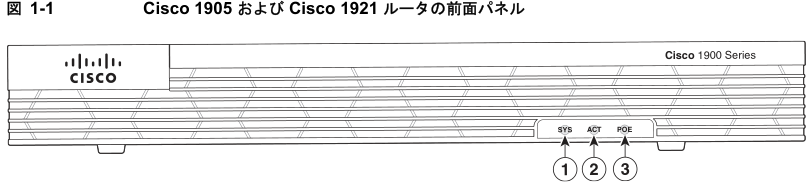

7 0 7 3 5 2

Cisco 1900 シリーズ ハードウェア インストレーション

1-2

OL-19084-03-J

# Page 3

第 1 章 ルータの概要

## シャーシの外観

### Table: Table 1

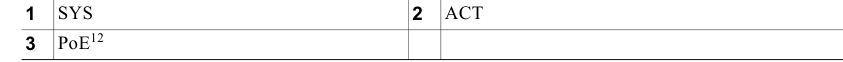

- 1. Power over Ethernet（POE）は、オプションの外部 PoE 電源と併用できます。

- 2. Cisco 1905 および Cisco 1921 ISR に EHWIC を取り付ける前に、PoE の電源をオフにします。

- 注意 Cisco 1905 および Cisco 1921 ISR に EHWIC を取り付ける前に、PoE の電源をオフにします。

図 1-2 は、Cisco 1905 および Cisco 1921 ルータの背面パネルにあるポートおよび LED を示していま す。

### Figure: 図 1-2 Cisco 1905 および Cisco 1921 ルータの背面パネル（図は 1921）

- 1. Voice/WAN Interface Card（VWIC; 音声/WAN インターフェイス カード）は、データだけをサポートします。

- 2. ダブル幅のスロットは、1921 だけにあります。

- 3. 1905 のスロット 0（右）には、取り外せないインターフェイス カードが取り付けられた状態で出荷されます。ス ロット 1（左）のみを使用できます。

- 4. 1905 および 1921 に取り付けられる EHWIC ギガビット イーサネット スイッチは 1 つだけです。

- 5. サポート対象のモジュールについては、『Module Support on Cisco's Integrated Services Routers Generation 2』 （http://cisco.com/en/US/prod/collateral/routers/ps10538/aag_c07_563807.pdf）を参照してください。

- 6. Cisco 1905 および Cisco 1921 ISR に EHWIC を取り付ける前に、PoE の電源をオフにします。

Cisco 1900 シリーズ ハードウェア インストレーション

1-3

OL-19084-03-J

# Page 4

第 1 章 ルータの概要

## シャーシの外観

- 図 1-3 は、アンテナが取り付けられた Cisco 1941 ワイヤレス ルータの前面パネルを示しています。

- （注） 1905 のスロット 0（右）には、取り外せない EHWIC が取り付けられた状態で出荷されます。

### Figure: 図 1-3 Cisco 1941W ルータの前面パネル

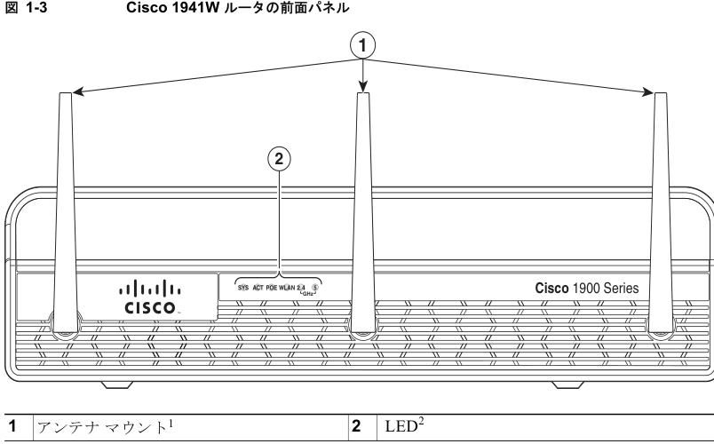

2 7 3 1 5 2

- 1. アンテナ マウントは、非ワイヤレス モデルでは使用できません。

- 2. 一部の LED は、非ワイヤレス モデルでは使用できません。

図 1-4 は、Cisco 1941W（アンテナなし）の前面パネルおよび LED の名前を示しています。

図 1-4

Cisco 1941 および Cisco 1941W ルータの LED

1 2 3 4

5

Cisco 1900 Series

SYS ACT POE WLAN 2.4

GHz

5 9 9 0 5 2

### Table: Table 1

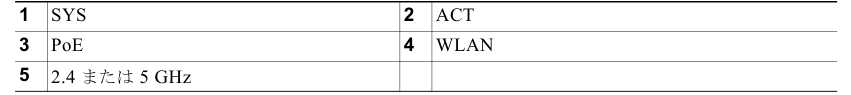

Cisco 1900 シリーズ ハードウェア インストレーション

1-4

OL-19084-03-J

# Page 5

第 1 章 ルータの概要

## シャーシの外観

図 1-5 は、Cisco 1941 および Cisco 1941W ルータの背面パネルにあるポートおよび LED を示してい ます。

### Figure: 図 1-5 Cisco 1941 および Cisco 1941W ルータの背面パネル

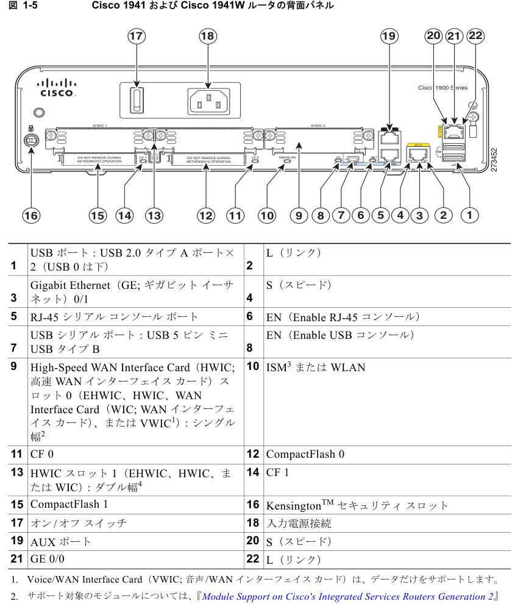

2. サポート対象のモジュールについては、『Module Support on Cisco's Integrated Services Routers Generation 2』 （http://cisco.com/en/US/prod/collateral/routers/ps10538/aag_c07_563807.pdf）を参照してください。

Internal Service Module（ISM）。

- 3.

- 4. ダブル幅のスロットは、シングル幅の EHWIC、HWIC、WIC、または VWIC（データ専用）をスロットの左側に 収容できます。

Cisco 1900 シリーズ ハードウェア インストレーション

1-5

OL-19084-03-J

# Page 6

第 1 章 ルータの概要

ハードウェアの機能

ハードウェアの機能

- 「製品シリアル番号の場所」（P.1-6）

- 「組み込みインターフェイス」（P.1-8）

- 「着脱式で交換可能なオプション モジュール」（P.1-8）

- 「メモリ」（P.1-9）

- 「LED インジケータ」（P.1-10）

- 「シャーシの換気」（P.1-12）

- 「リアルタイム クロック」（P.1-12）

- 「シャーシのセキュリティ」（P.1-13）

- 「ワイヤレス LAN 接続」（P.1-13）

- 「ボー リセット ボタン」（P.1-13）

## 製品シリアル番号の場所

Cisco 1905 および Cisco 1921 ルータのシリアル番号ラベルおよび Common Language Equipment Identifier（CLEI）ラベルは、シャーシの背面にあります （図 1-6 を参照）。Cisco 1905 および Cisco 1921 ルータの Product ID（PID; 製品 ID）ラベルはシャーシの底面にあります （図 1-8 を参照）。 Cisco 1940 シリーズ ルータのシリアル番号ラベルは、シャーシ背面の引き出しタブにあります （図 1-8 を参照）。

### Figure: 図 1-6 Cisco 1905 および Cisco 1921 ルータのシリアル番号および CLEI の位置

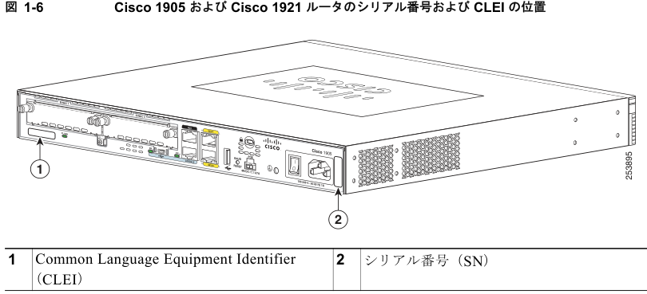

Cisco 1900 シリーズ ハードウェア インストレーション

- 1-6

OL-19084-03-J

# Page 7

第 1 章 ルータの概要

ハードウェアの機能

図 1-7

- Cisco 1905 および Cisco 1921 ルータの PID および準拠ラベルの位置

### Figure: Figure 1

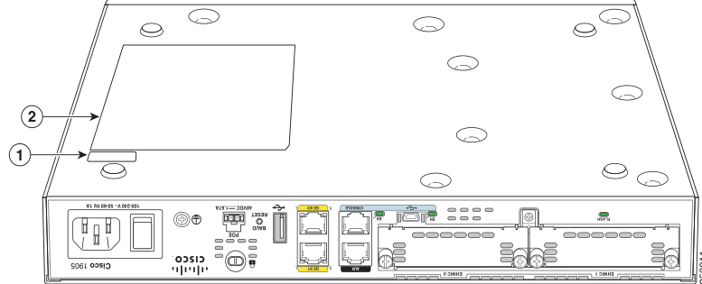

1 1 9 3 5 2

1 製品 ID（PID）

2 準拠ラベル

Cisco 1940 シリーズ ルータのシリアル番号、PID/VID、および CLEI 番号の位置

図 1-8

OVE DURING K OPERATION 2

1

4

3

0 7 3 1 5 2

## DO NOT REMOVE DURING NETWORK OPERATION

## DO NOT REMOVE DURING NETWORK OPERATION

### Table: Table 1

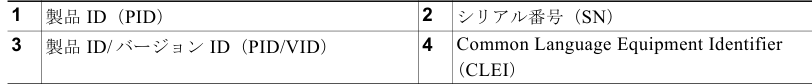

- （注） Cisco 1900 シリーズ ルータのシリアル番号は、11 文字です。

Cisco 1900 シリーズ ハードウェア インストレーション

1-7

OL-19084-03-J

# Page 8

第 1 章 ルータの概要

ハードウェアの機能

## Cisco Product Identification（CPI）ツール

Cisco Product Identification（CPI）ツールは、シスコ製品のシリアル番号ラベルの位置を示す詳細な 図と説明を提供します。このツールには次の機能があります。

- ツリー構(cid:13312)の製品階層を用いてモデルを閲覧できる検索オプション

- 複数の製品をより簡単に検索することのできる最終結果ページの検索フィールド

- 販売終了製品は、結果リストで明瞭に識別

このツールを使用すると、シリアル番号ラベルを見つけ、製品を特定するプロセスが簡単になります。 シリアル番号情報があると認定プロセスが迅(cid:13311)になります。また、サポート サービスにアクセスする 際に重要です。

Cisco Product Identification ツールには次の URL でアクセスできます。

http://tools.cisco.com/Support/CPI/index.do

## 組み込みインターフェイス

次の表に、Cisco 1900 シリーズ ルータで使用可能なインターフェイスを示します。

- （注） RJ-45 コンソール ポートまたは USB コンソール ポートのいずれかを使用できます。両方のポートを同

- 時に使用することはできません。

### Table: 表 1-1 Cisco 1900 シリーズ ルータで使用可能なインターフェイス

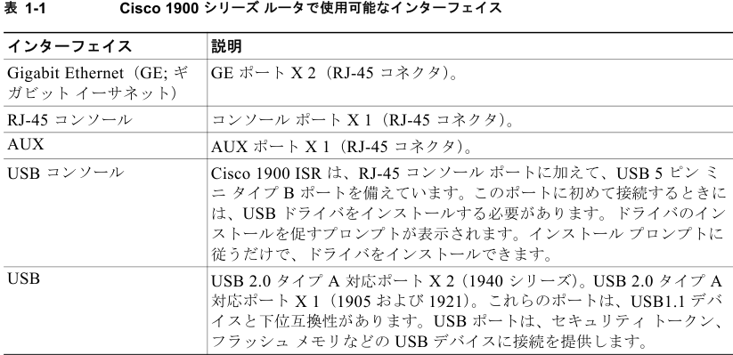

## 着脱式で交換可能なオプション モジュール

一部のモジュールは、シャーシのスロットに挿入することによって、またはシャーシを開いて内部のコ ネクタに差し込むことによって取り付けることができます。WLAN が工場で取り付けられています。

- CompactFlash メモリおよび拡張高(cid:13311) WAN インターフェイス カード（EHWIC）は、Cisco 1940 シリーズのシャーシのスロットに収まります。また、シャーシを開かずに、取り付けまたは取り外 しを実行できます。

Cisco 1900 シリーズ ハードウェア インストレーション

1-8

OL-19084-03-J

# Page 9

第 1 章 ルータの概要

## ハードウェアの機能

- Cisco 1940 シリーズ シャーシ内部のコネクタは、現場で取り付け可能なオプションの Internal Service Module（ISM）を収容します。『Installing and Upgrading Internal Modules and FRUs in Cisco 1900 Series ISRs』を参照してください。

- Cisco 1941W シャーシ内部の ISM コネクタには、工場で取り付けられたオプションのワイヤレス LAN カードが収容されます。ISM コネクタに、WLAN カードが取り外せないように取り付けられ ます。

- Cisco 1940 シリーズ ISR の特長である内部電源装置のアップグレード（オプション）を行うと、 オプションの統合型スイッチ モジュールに対してインライン電源（802.3af 対応 Power-over-Ethernet（PoE）およびシスコ標準のインライン電源）が供給されます。Cisco 1905 および Cisco 1921 には PoE 用の外部供給口があります。（図 1-2 を参照）。

- Cisco 1905 または Cisco 1921 ルータには、ユーザが取り付けおよび交換できるモジュールはあり ません。シャーシ カバーを取り外さないでください。

- 注意 Cisco 1905 および Cisco 1921 ISR に EHWIC を取り付ける前に、PoE の電源をオフにします。

表 1-2 に、オプション モジュールの概要を示します。

### Table: 表 1-2 Cisco 1940 シリーズの着脱式で交換可能なモジュールの概要

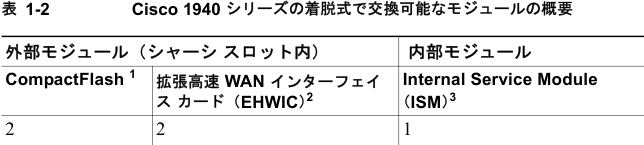

- 1. シスコから購入した高性能 CompactFlash（CF）だけが、Cisco 1900 シリーズ ISR で動 作します。これらのルータではレガシー CF は機能しません。レガシー CF を挿入する と、次のエラー メッセージが表示されます。

WARNING: Unsupported compact flash detected.Use of this card during normal operation can impact and severely degrade performance of the system.Please use supported compact flash cards only.

- 2. HWIC、WIC、および VWIC（データ専用）がサポートされています。

- 3. 非ワイヤレス モデルだけです。

## メモリ

Cisco 1900 シリーズ ルータには、次のタイプのメモリが搭載されています。

- DRAM：実行コンフィギュレーションおよびルーティング テーブルを保存します。ネットワーク インターフェイスによるパケット バッファリングに使用されます。Cisco IOS ソフトウェアは DRAM メモリから実行されます。

- Boot/Nonvolatile Random-Access Memory（NVRAM; 不揮発性 RAM）：内蔵フラッシュ メモリ。 ブートストラップ プログラム（ROM モニタ）、コンフィギュレーション レジスタ、およびスター トアップ コンフィギュレーションを保存します。

- フラッシュ メモリ：外部フラッシュ メモリ（1940 シリーズのみ）。オペレーティング システム ソ フトウェアのイメージを保存します。

Cisco 1900 シリーズ ハードウェア インストレーション

1-9

OL-19084-03-J

# Page 10

第 1 章 ルータの概要

## ハードウェアの機能

表 1-3 に、Cisco 1900 シリーズ ルータのメモリ オプションの概要を示します。RAM のデフォルトの メモリ数は、最小使用可能メモリを表します。Cisco 1940 シリーズ ISR の最大搭載可能メモリまで、 追加のメモリをデフォルトの倍数単位で取り付けることができます。Cisco 1905 および Cisco 1921 の メモリは工場で取り付けられていて固定されており、拡張スロットはありません。

### Table: 表 1-3 ルータのメモリ仕様

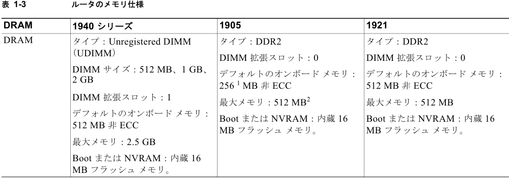

- 1. 256 MB は、ネット ブートおよびウォーム アップグレード機能をサポートしません。ネット ブートおよびウォーム アップグレードには 512 MB のメモリが必要です。

- 2. 512 MB のアクティベーションにはメモリ ライセンス機能が必要です。詳細については、『Cisco IOS Software Activation Configuration Guide』を参照してください。

## LED インジケータ

表 1-4 に、ルータのベゼルまたはシャーシにある LED インジケータの概要を示します。ただし、イン ターフェイス カードにある LED は含まれません。すべてのモデルにすべての LED が搭載されている わけではありません。

### Table: 表 1-4 Cisco 1900 シリーズの LED インジケータの概要

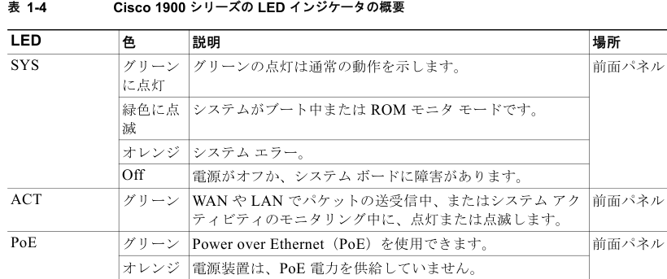

Cisco 1900 シリーズ ハードウェア インストレーション

1-10

OL-19084-03-J

# Page 11

第 1 章 ルータの概要

ハードウェアの機能

### Table: 表 1-4 Cisco 1900 シリーズの LED インジケータの概要 （続き）

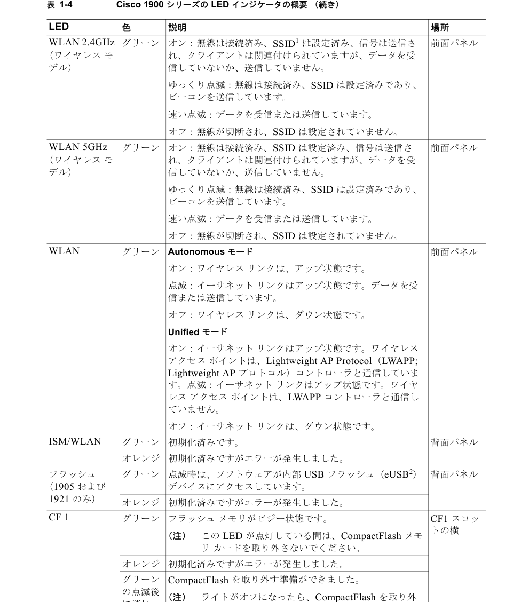

グリーン の点滅後 に消灯

します。

Cisco 1900 シリーズ ハードウェア インストレーション

1-11

OL-19084-03-J

# Page 12

第 1 章 ルータの概要

## ハードウェアの機能

### Table: 表 1-4 Cisco 1900 シリーズの LED インジケータの概要 （続き）

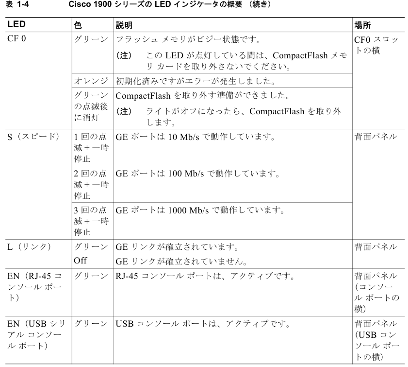

- 1. SSID = Service Set Identifier（サービス セット ID）

- 2. eUSB = 組み込み型 USB

## シャーシの換気

内蔵ファンは、シャーシの冷却を行います。オンボードの温度センサーは、ファンの(cid:13311)度を制御しま す。ルータに電力が供給されている間、ファンは常にオンになっています。ほとんどの条件下では、 ファンは最低(cid:13311)度で作動し、電力を節約してファンの雑音を軽減します。周囲温度が高い場合は、必要 に応じて、高(cid:13311)で作動します。「シャーシ内の空気の流れを示す図」（P.4-3）を参照してください。

## リアルタイム クロック

バッテリ バックアップ付き内部リアルタイム クロックは、システム ソフトウェアにシステム電源投入 時の時刻を提供します。これによって、システムは Certification Authority（CA; 認証局）の証明書の 有効性を検証できます。Cisco 1900 シリーズ ルータには、リチウム電池が搭載されています。この電 池は、当該ルータに指定された動作環境条件のもとではルータの寿命が終わるまで持ちます。この電池 は現場交換できません。

Cisco 1900 シリーズ ハードウェア インストレーション

1-12

OL-19084-03-J

# Page 13

第 1 章 ルータの概要

インターフェイス番号

- （注） Cisco 1900 ISR のリチウム電池が故障した場合には、ルータをシスコに返却して修理する必要があり

ます。

バッテリは現場交換できるように設計されていませんが、次の警告を留意してください。

警告 使用済みバッテリは、製(cid:13312)元の指示に従って処分してください。ステートメント 1015

## シャーシのセキュリティ

ルータのシャーシには、背面パネルに Kensington TM セキュリティ スロットが付いています。シャー シは、Kensington™ ロックダウン装置を使用してデスクトップまたは他の表面に固定できます。

## ワイヤレス LAN 接続

組み込みの Wi-Fi CERTIFIED™（802.11a/b/g/n 準拠ワイヤレス アクセス ポイント）は、ルータにオ プション機能としてプリインストールされています。Cisco 1900 ルータは、Autonomous 機能と Unified 機能の両方、およびネットワーク構成をサポートします。

ワイヤレス アクセス ポイントには、接続用の外部コンソール ポートはありません。ワイヤレス装置を 設定するには、コンソール ケーブルを使用して、第 3 章「Cisco 1900 シリーズ ルータのケーブル情報 と仕様」に記載されるように PC をホスト ルータのコンソールに接続してから、Cisco IOS コマンドラ イン インターフェイス（CLI）を使用してインターフェイスにアクセスする必要があります。

表 1-5 では、ワイヤレス ルータの無線とアンテナについて説明します。

## ボー リセット ボタン

Cisco 1905 および Cisco 1921 ISR の背面パネルには、ボー リセット ボタンがあります。電源がオンの 場合にこのボタンを押すと、ROMMON によりルータがデフォルトのコンソール ポート構成にリセッ トされます。ボー リセット ボタンを 30 秒以上押すと、ルータはデフォルトの読み取り専用の ROMMON イメージになります。デフォルトのコンソール ポート構成は、9600 ボー、8 データ ビッ ト、1 ストップ ビット、パリティなし、フロー制御なしに設定されます。

インターフェイス番号

Cisco 1900 シリーズ ルータの各インターフェイス（ポート）は、番号によって識別されます。Cisco 1900 シリーズ ルータには、次の Wide-Area Network（WAN; ワイドエリア ネットワーク）および Local-Area Network（LAN; ローカルエリア ネットワーク）インターフェイス タイプが含まれていま す。

- オンボードのギガビット イーサネット（GE）LAN インターフェイス× 2。

- WIC、VWIC（データ専用）、および HWIC を取り付け可能なスロット× 2。1905 の右のスロット には、EHWIC が工場で取り付けられた状態で出荷されます。

Cisco 1900 シリーズ ハードウェア インストレーション

1-13

OL-19084-03-J

# Page 14

第 1 章 ルータの概要

## 仕様

スロット番号の形式は、インターフェイス タイプ 0/スロット番号/インターフェイス番号です。表 1-6 にインターフェイス番号の概要を示します。スロット番号を識別する場合は、図 1-5 を参照してくださ い。

### Table: 表 1-6 インターフェイス番号

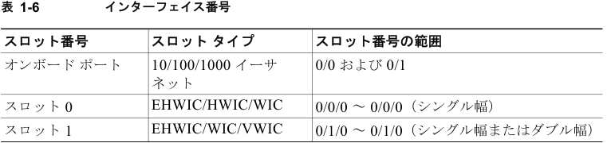

- （注） Cisco 1900 シリーズ ルータ上で非同期インターフェイスを設定する場合、番号形式は 0/スロット/ポー トです。async インターフェイスに関連付けられている回線は、インターフェイス番号を使って async 回線を指定するだけで設定できます。たとえば、回線 0/0/0 は、スロット 0 の WIC-2A/S のインター フェイス シリアル 0/0/0 に関連付けられている回線を指定します。同様に、回線 0/1/1 は、スロット 1 の WIC-2AM のインターフェイス async 0/1/1 に関連付けられている回線を指定します。

## 仕様

表 1-7 に Cisco 1905 および Cisco 1921 シリーズ ルータの仕様を示します。表 1-8 に Cisco 1940 シ リーズ ルータの仕様を示します。

### Table: 表 1-7 Cisco 1905 および 1921 シリーズ ルータの仕様1

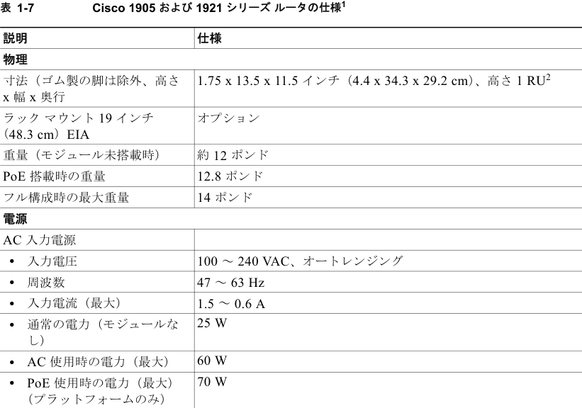

ラック マウント 19 インチ （48.3 cm）EIA

Cisco 1900 シリーズ ハードウェア インストレーション

1-14

OL-19084-03-J

# Page 15

第 1 章 ルータの概要

仕様

### Table: 表 1-7 Cisco 1905 および 1921 シリーズ ルータの仕様1 （続き）

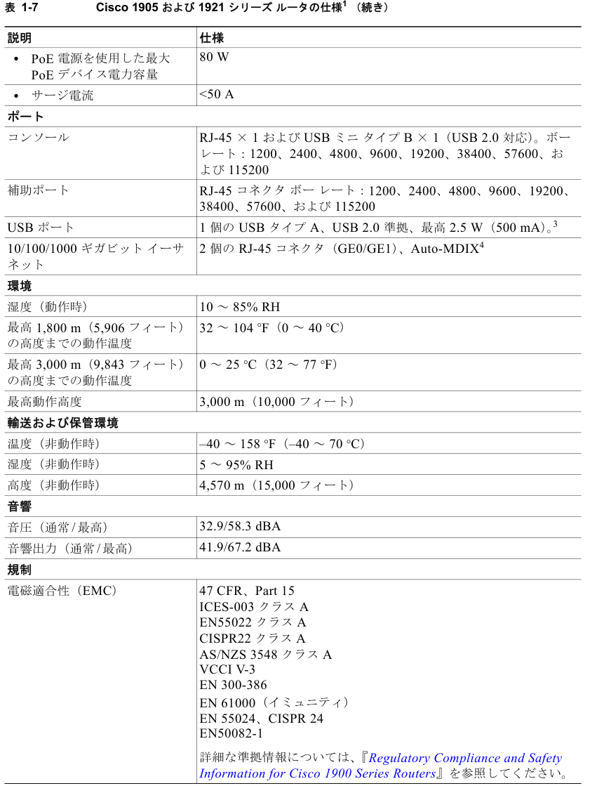

Cisco 1900 シリーズ ハードウェア インストレーション

1-15

OL-19084-03-J

# Page 16

第 1 章 ルータの概要

仕様

### Table: 表 1-7 Cisco 1905 および 1921 シリーズ ルータの仕様1 （続き）

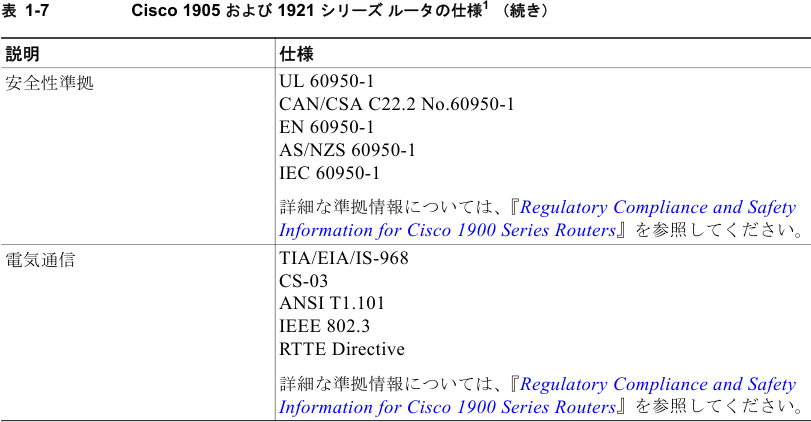

- 1. 詳細については、『Cisco 1900 Series Integrated Services Routers Data Sheet』を参照してください。

- 2. Rack Unit（RU; ラック ユニット）

- 3. それぞれ 480 Mb/s。両方を使用する場合、帯域幅は共有されます。

- 4. Auto-MDIX = Auto Media-Dependent Interface Cross Over（自動メディア依存型インターフェイス クロス オー バー）

### Table: 表 1-8 Cisco 1940 シリーズ ルータの仕様1

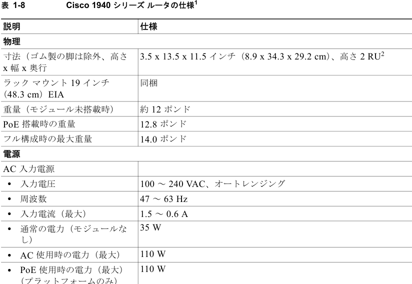

AC 使用時の電力（最大） 110 W 110 W • PoE 使用時の電力（最大） （プラットフォームのみ）

Cisco 1900 シリーズ ハードウェア インストレーション

1-16

OL-19084-03-J

# Page 17

第 1 章 ルータの概要

仕様

### Table: 表 1-8 Cisco 1940 シリーズ ルータの仕様1 （続き）

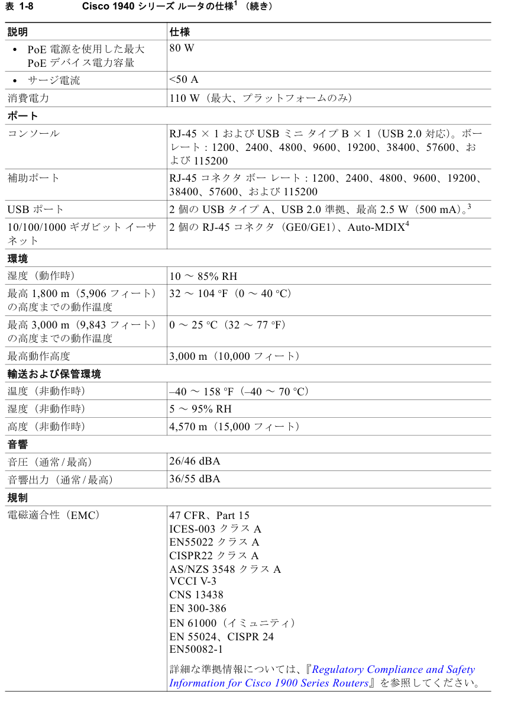

Cisco 1900 シリーズ ハードウェア インストレーション

1-17

OL-19084-03-J

# Page 18

第 1 章 ルータの概要

## 適合規格

### Table: 表 1-8 Cisco 1940 シリーズ ルータの仕様1 （続き）

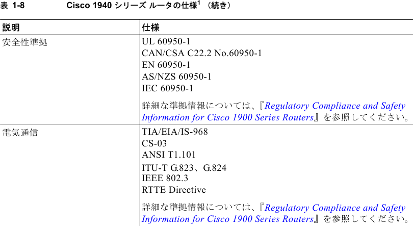

- 1. 詳細については、『Cisco 1900 Series Integrated Services Routers Data Sheet』を参照してください。

- 2. Rack Unit（RU; ラック ユニット）

- 3. それぞれ 480 Mb/s。両方を使用する場合、帯域幅は共有されます。

- 4. Auto-MDIX = Auto Media-Dependent Interface Cross Over（自動メディア依存型インターフェイス クロス オー バー）

## 適合規格

規制については、『Regulatory Compliance and Safety Information for Cisco 1900 Series Routers』を参 照してください。

Cisco 1900 シリーズ ハードウェア インストレーション

1-18

OL-19084-03-J

