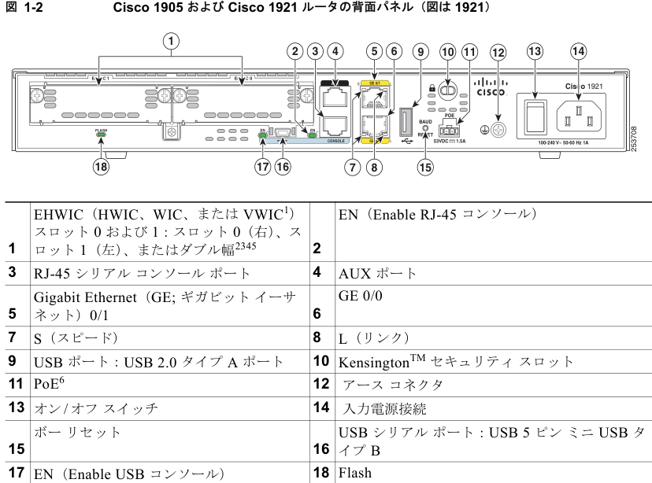

# Extracted Content from c72c70e5-63c0-43f5-b532-66406ca943a6

---

# Page 1

第 1 章 ルータの概要

## シャーシの外観

### Table: Table 1

- 1. Power over Ethernet（POE）は、オプションの外部 PoE 電源と併用できます。

- 2. Cisco 1905 および Cisco 1921 ISR に EHWIC を取り付ける前に、PoE の電源をオフにします。

- 注意 Cisco 1905 および Cisco 1921 ISR に EHWIC を取り付ける前に、PoE の電源をオフにします。

図 1-2 は、Cisco 1905 および Cisco 1921 ルータの背面パネルにあるポートおよび LED を示していま す。

### Figure: 図 1-2 Cisco 1905 および Cisco 1921 ルータの背面パネル（図は 1921）

- 1. Voice/WAN Interface Card（VWIC; 音声/WAN インターフェイス カード）は、データだけをサポートします。

- 2. ダブル幅のスロットは、1921 だけにあります。

- 3. 1905 のスロット 0（右）には、取り外せないインターフェイス カードが取り付けられた状態で出荷されます。ス ロット 1（左）のみを使用できます。

- 4. 1905 および 1921 に取り付けられる EHWIC ギガビット イーサネット スイッチは 1 つだけです。

- 5. サポート対象のモジュールについては、『Module Support on Cisco's Integrated Services Routers Generation 2』 （http://cisco.com/en/US/prod/collateral/routers/ps10538/aag_c07_563807.pdf）を参照してください。

- 6. Cisco 1905 および Cisco 1921 ISR に EHWIC を取り付ける前に、PoE の電源をオフにします。

Cisco 1900 シリーズ ハードウェア インストレーション

1-3

OL-19084-03-J

